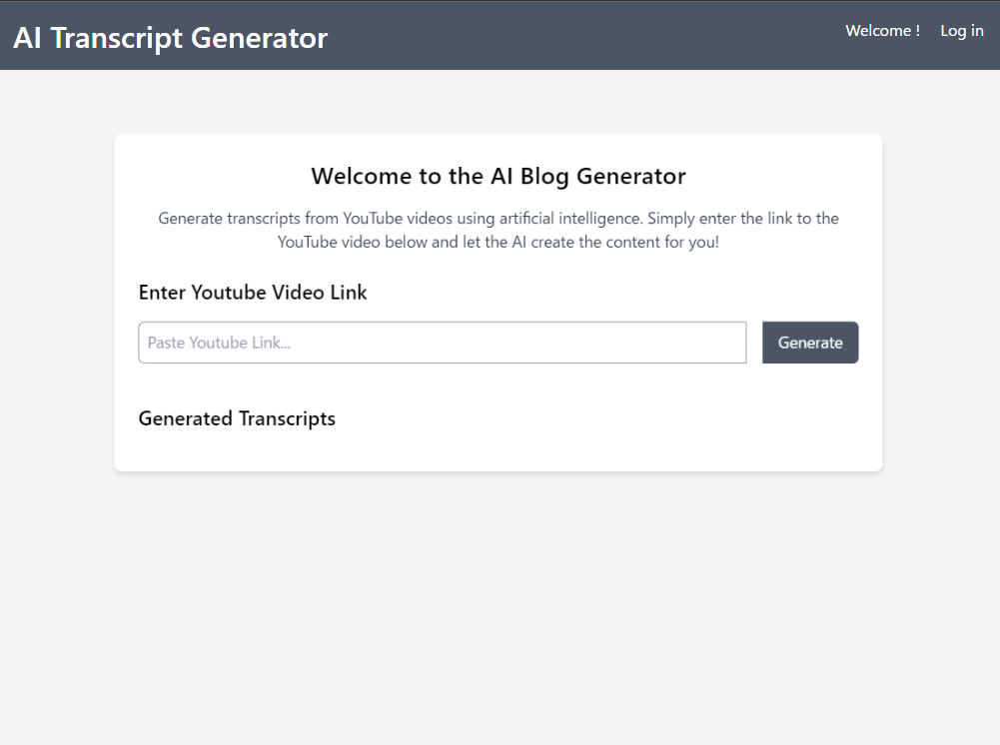
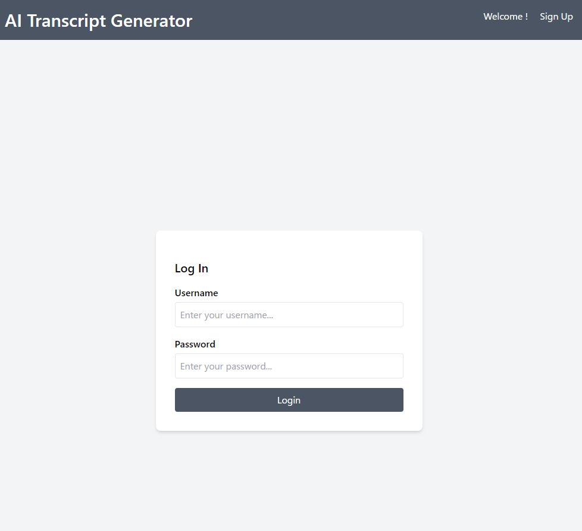
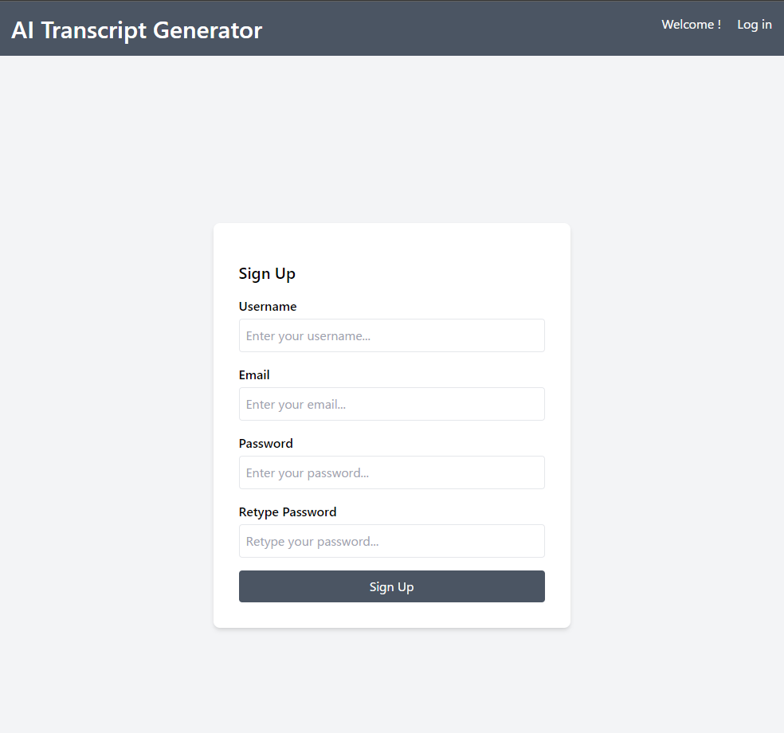
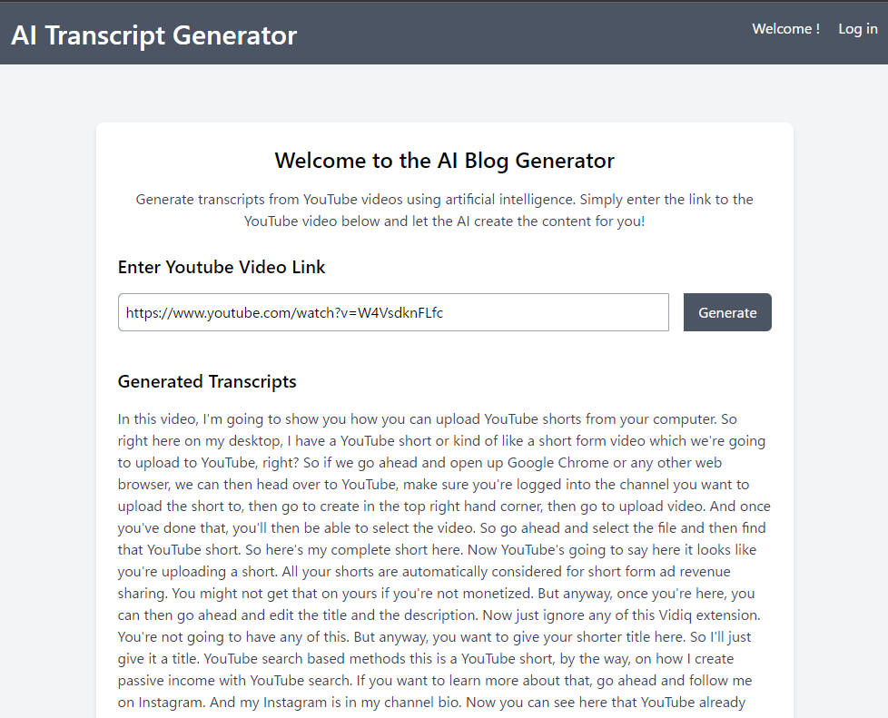
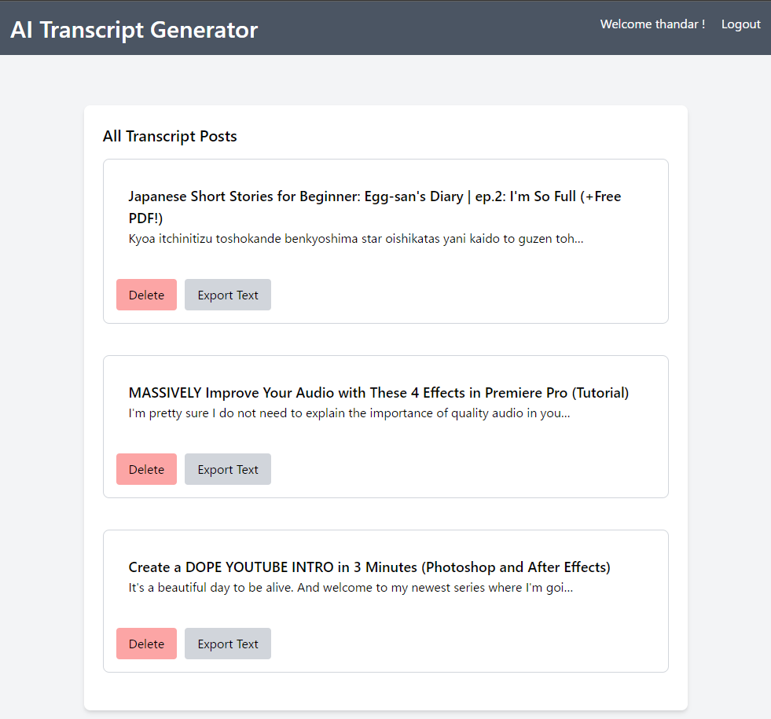

# AI_Transcript_Gernerator
AI Transcript generator from user input Youtube link for full stack development.
This project inspire from Free Code Camp lecture.



## Development Environment Setup

### Windows
```
pip install virtualenv
```
```
python3 -m venv venv
```
```
.\venv\bin\activate\Scripts\activate
```
```
cd backend/ai_blog_app
pip install -r requirements.txt
```
```
python manage.py runserver
```

### Ubuntu
```
python3 -m venv venv
```
```
source venv/bin/activate
```
```
cd backend/ai_blog_app
pip install -r requirements.txt
```
```
python manage.py runserver
```

#### When exit from venv, run following command
```
deactivate
```

## Database
db.sqlite3

## User Log In


## User Sign Up


## Example Result Page


## Saved Blog Posts
- After log in, System will save all transcripted data as Posts.
- We can check all saved Transcript Posts.
- Moreover, we can delete unused transcript posts and export as text file also.
